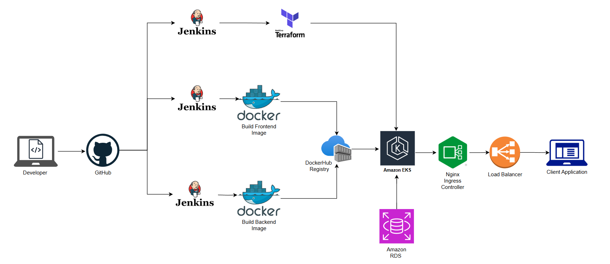

# Scalable CI/CD Pipeline for Dockerized 3-Tier Application on AWS EKS
## Overview
The project involves the following components:
- Infrastructure: Kubernetes EKS Cluster created using Terraform.
- Backend: Java Spring Boot application built using Maven and containerized with Docker.
- Frontend: React-based web application built using Node.js and npm, also containerized with Docker.
- CI/CD Pipeline: Jenkins automates the process of building Docker images, deploying them to EKS, and managing infrastructure.
- Database: The application is configured to connect to a MariaDB instance hosted on AWS RDS.

The CI/CD pipeline automates the process of:
   1. Provisioning the infrastructure (EKS cluster) using Terraform.
   2. Building and pushing Docker images for the backend and frontend.
   3. Deploying the application to Kubernetes EKS.


## Project Structure

```
eks-3tier-app-cicd/
│
├── app/                          # Source code for the frontend and backend applications.
│   ├── frontend/                 # React app built using Node.js and Vite.
│   │   └── Dockerfile            # Builds Docker image for the frontend.
│   ├── backend/                  # Java Spring Boot backend app using Maven.
│   │   └── Dockerfile            # Builds Docker image for the backend.
│
├── k8s/                          # Kubernetes YAML manifests for application deployment.
│   ├── frontend-deployment.yaml  # Deployment for the React frontend.
│   ├── frontend-service.yaml     # Service to expose the frontend to the cluster or ingress.
│   ├── backend-deployment.yaml   # Deployment for the Spring Boot backend.
│   ├── backend-service.yaml      # Service to expose the backend to the frontend or ingress.
│   ├── db-deployment.yaml        # (Optional) Deployment manifest for running MariaDB in-cluster (alternative to RDS).
│   ├── db-service.yaml           # (Optional) Service to expose MariaDB pod.
│   ├── ingress.yaml              # Ingress resource to route HTTP traffic to frontend and backend.
│   └── secret.yaml               # Kubernetes Secret storing DB credentials securely.
│
├── jenkins/                      # Jenkins pipeline files for CI/CD automation.
│   ├── app.Jenkinsfile           # Jenkins pipeline for building & deploying the application.
│   └── infra.Jenkinsfile         # Jenkins pipeline for provisioning infrastructure using Terraform.
│
├── Terraform/                    # Infrastructure as Code using Terraform for AWS setup.
│   ├── main.tf                   # Main configuration (EKS cluster, VPC, RDS, etc.).
│   ├── variables.tf              # Input variables used across Terraform modules.
│   ├── outputs.tf                # Outputs like cluster name, kubeconfig, etc.
│
├── docs/                         # Documentation related to setup, configuration, and usage.
│   ├── installation-guide.md     # Step-by-step guide for installing required tools (Docker, Terraform, kubectl, etc.).
│   ├── database-setup.md         # Instructions to set up MariaDB (preferably via AWS RDS).
│   ├── jenkins-setup.md          # Guide to configure Jenkins, credentials, and pipelines.
│   ├── terraform-configuration.md# How to use and customize Terraform for EKS infrastructure.
│   ├── kubernetes-setup.md       # How to configure and deploy K8s manifests (Secrets, Deployments, Ingress, etc.).
│   └── locally-run.md            # Guide for running the app locally using Docker Compose or manual commands.
│
├── install.sh                    # Optional automation script for installing prerequisites or initializing setup.
│
└── README.md                     # Main project overview, architecture, workflow, and usage instructions.

```

## Architecture


## Tech Stack
- **Frontend**: React, Vite, Node.js, and npm — Chosen for building a fast and scalable UI.
- **Backend**: Java, Spring Boot, and Maven — Ideal for developing REST APIs with solid performance.
- **Database**: MariaDB on AWS RDS — A reliable relational database service with automatic scaling and backups.
- **CI/CD**: Jenkins, Terraform — For automating the build and deployment pipelines, and provisioning infrastructure.
- **Containerization**: Docker — Ensures consistency and portability across environments.
- **Cloud**: AWS (EKS, RDS, VPC, IAM) — Provides scalable cloud infrastructure and services.
- **Orchestration**: Kubernetes (EKS) — Manages containerized applications and ensures high availability.


## Environment Variables

| Variable                    | Used In   | Description                              |
|----------------------------|-----------|------------------------------------------|
| SPRING_DATASOURCE_URL      | Backend   | JDBC URL for MariaDB                     |
| SPRING_DATASOURCE_USERNAME | Backend   | DB username                              |
| SPRING_DATASOURCE_PASSWORD | Backend   | DB password                              |
| VITE_API_URL               | Frontend  | URL to access backend API                |


## Workflow: 

1. **Clone the repository**: 
   - Start by cloning the project to your local machine.

2. **Set up the database**: 
   - Follow the [database setup guide](docs/database-setup.md) to create and configure the MariaDB database.

3. **Install necessary tools**: 
   - Refer to the [installation guide](docs/installation-guide.md) for the tools required (e.g., Docker, Terraform, Jenkins, etc.).

4. **Configure Jenkins**: 
   - Follow the [Jenkins setup guide](docs/jenkins-setup.md) to set up Jenkins credentials and build pipelines for both Terraform and the application.

5. **Set up EKS using Terraform**: 
   - Check out the [Terraform configuration guide](docs/terraform-configuration.md) to modify AWS region, cluster, and node settings.

6. **Configure Kubernetes Manifests**: 
   - Review the [Kubernetes setup guide](docs/kubernetes-setup.md) to modify Docker image names and configure database credentials via Kubernetes Secrets.


**To verify that the deployment is successful, ensure that**:

- The application is accessible via the configured Ingress.

- All pods in EKS are running successfully (`kubectl get pods`).

- Database connections are functioning as expected.

## Conclusion
This project demonstrates an automated CI/CD pipeline for deploying a 3-tier application on AWS EKS. By using Jenkins, Terraform, Docker, and Kubernetes, we achieve:

- Fully automated CI/CD pipeline
- Infrastructure as Code using Terraform
- Containerized deployments with Docker
- Scalable and resilient architecture using Kubernetes
- Secure database integration with AWS RDS


## Future Improvements
- Add automated unit testing in CI pipeline
- Integrate AWS Secrets Manager for enhanced secret handling
- Implement monitoring using Prometheus & Grafana
- Set up GitOps-based deployment with ArgoCD